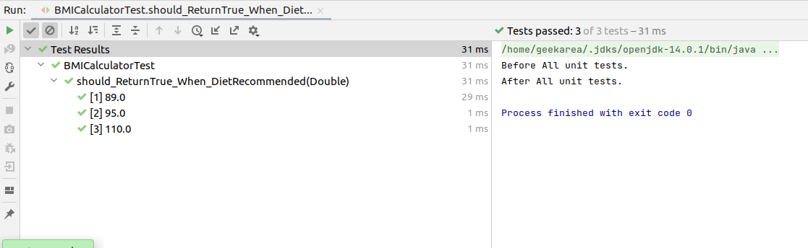

# HealthyAppJunit5

## Junit 5 features

## @BeforeEach @AfterEach:
    Name of @Before & @After is changed to @BeforeEach and @AfterEach in Junit5

## AssertAll(executable1, executable2,..):
    It will execute all given lambda expressions and give result. Executable is lambda expression of java8.
    In general, if one assert Method fail then other methods after that will be not executed, so we will not able to verify all assertion at once.
    AssertAll method is used to run all the assertions even if one or more than one fails during execution.

## @ParameterizedTest()
    @ValueSource: Parameterized test case with given values to execute test case with different inputs.
    
    @CsvSource: Parameterized Test case with Value source as comma separated values in pairs.
    @CsvFileSource: Parameterized Test case with Value source as CSV file with inputs in pairs.
    

## @RepeatedTest: repeat test case n number of times.

## assertTimeout(Duration.ofMillis(1),executable): Using assertTimeout, perform performance testing can be done.
  For example: As per Given condition, if executable will take time more than 1 Millis seconds, test case will fail.

## assumeTrue(this.env.equals("prod")): Testcase will be not executed if condition fail. It will skip the test case.
  AssumeTrue is different from assertTrue as it will skip the test case if condition fail, while assertTrue fails testcase if condition fail.

## @Nested: It is be used to organize all test cases in different inner classes of TestClass.

## @DisplayName("Custom Test class/Testcase name"): It helps to give custom display name to testcase and test class.

## @DisabledOnOS(OS.WINDOWS): Test method will skip on windows OS machine.

## @Disabled: Test method will not run/Skip.
